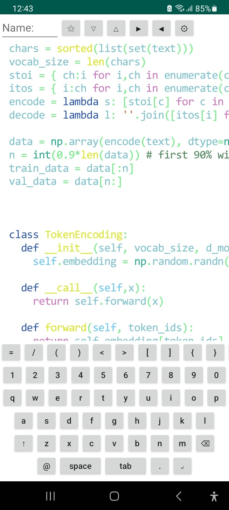
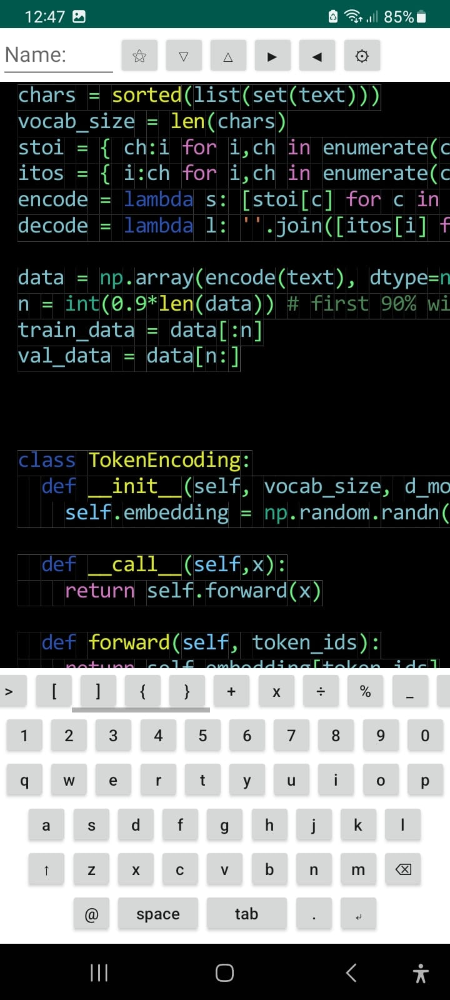
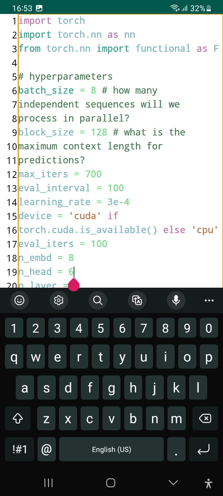
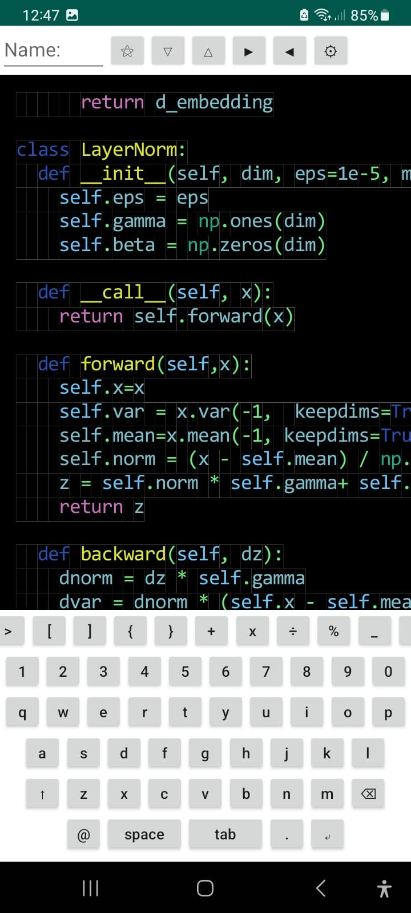

<div align="center">

<picture>
  <h1 >Orbit Python Editor</h1>

  <a href="url"></a>

</picture>
I just published my first Python editor app on Google Play!

I’ve built Orbit Python Editor entirely in Python3.8 (using Toga, and Briefcase) and released it on Android:

<a style="display:inline-block;line-height:18px;margin-top:8px;padding:0;font-size:13px" href="https://play.google.com/store/apps/details?id=com.Orbit_Python_editor.Orbit_Python_editor">
<b>👉 </b> Try 
<b> Orbit Python Editor</b> 
on Google Play
</a>


<h3>

[Homepage](https://github.com/devran1/code_editor) 

</h3>

[](https://github.com/devran1/code_editor/stargazers)

</div>


****

<div align="center">


screen shots of the app

<a href="url"></a>
<a href="url"></a>
<a href="url"></a>
<a href="url"></a>

</div>


****


Why I built this:

To have a portable Python REPL and editor on my phone, with syntax highlighting, dark mode, and the ability to write and test scripts anywhere.

To explore Python → Android workflows using Briefcase + Toga.

To experiment with building an entire editor inside a canvas for fine-grained control and cross-platform potential.


Things I learned:
1) ✅ Handling Android permissions from Python requires JNI (jclass) calls, even for simple file operations.
2) ✅ Managing screen sizes dynamically on Android through Java calls inside Python.
3) ✅ Using briefcase for building, packaging, signing, and publishing an AAB for the Play Store.
4) ✅ Debugging layout challenges, dark mode color issues, text overlays, and input methods in a low-level drawing-based editor.


This is not my first time of building an editor, first time I used kivy, it was really easy but compiling to android took a lot of time, it didn't give any errors and didn't workout for some reasons. After a while, I learned about toga/briefcase. I used html, css and build a web frontend. I used webview functionality and it didn't worked. Then I tried toga multilineinput which didn't have coloring options for text. Finally I ended up writing everything in toga canvas. For that reason I will take some time to rest, and then turn back to this project to fix it, and add new functionalities.


Next goals:
1) 🔹 Add line numbers, auto-indent, and settings (font size) .
2) 🔹 Enable sharing scripts, AI-assisted completions, and Flask/Django snippets.
3) 🔹 Screen sharing with bluetooth
4) 🔹 Possibly build a web and desktop version using the same editor logic. (No need to build integration with other editors)
5) 🔹 ctrl + button combinations (such as ctrl + s for saving ctrl +4 o for opening documents)
6) 🔹 adding buttons to move inside the text
7) 🔹 add copying button and partial copying
8) 🔹 library/documentation and shortcut informations
9) 🔹 a bar that shows the where you are which line
10) 🔹 share the screen or the code within the network


⚠️ All the libraries you can just import and use

```Brotli-1.0.7 Pillow-9.2.0 PyNaCl-1.5.0 PyWavelets-1.1.1 PyYAML-6.0.2 Shapely-1.8.5 TA-Lib-0.4.17 TgCrypto-1.2.5 Twisted-19.10.0 aiohttp-3.9.1 argon2-cffi-20.1.0 astropy-5.1.1 aubio-0.4.9 backports.zoneinfo-0.2.1 bcrypt-3.1.7 bitarray-2.8.2 blis-0.4.1 cffi-1.13.2 chaquopy-crc32c-1.0.6 chaquopy-curl-7.76.1 chaquopy-flac-1.3.3 chaquopy-freetype-2.9.1 chaquopy-geos-3.8.1 chaquopy-hdf5-1.10.2 chaquopy-lame-3.100 chaquopy-libcxx-180000 chaquopy-libffi-3.3 chaquopy-libgfortran-4.9 chaquopy-libiconv-1.16 chaquopy-libjpeg-1.5.3 chaquopy-libogg-1.3.4 chaquopy-libomp-9.0.9 chaquopy-libpng-1.6.34 chaquopy-libraw-0.20.2 chaquopy-libsndfile-1.0.28 chaquopy-libtiff-4.5.0 chaquopy-libvorbis-1.3.7 chaquopy-libxml2-2.9.8 chaquopy-libxslt-1.1.32 chaquopy-libzmq-4.3.4 chaquopy-llvm-8.0.0 chaquopy-openblas-0.2.20 chaquopy-proj-9.1.1 chaquopy-secp256k1-20191011 chaquopy-ta-lib-0.4.0 chaquopy-zbar-0.23.90 coincurve-13.0.0 contourpy-1.0.5 cryptography-3.4.8 cvxopt-1.2.5 cymem-2.0.3 cytoolz-0.10.1 depthai-2.24.0.0 dlib-19.19.0 editdistance-0.5.3 ephem-3.7.7.0 frozenlist-1.2.0 gensim-3.8.3 gevent-23.9.1 google-crc32c-1.1.4 greenlet-3.0.1 grpcio-1.59.3 h5py-2.10.0 jpegio-0.2.8 kiwisolver-1.4.5 lameenc-1.5.1 llvmlite-0.31.0 lxml-4.6.3 lz4-4.3.2 matplotlib-3.6.0 miniaudio-1.59 multidict-5.1.0 murmurhash-1.0.2 netifaces-0.10.9 numba-0.48.0 numpy-1.19.5 opencv-contrib-python-4.5.1.48 opencv-contrib-python-headless-4.5.1.48 opencv-python-4.5.1.48 opencv-python-headless-4.5.1.48 pandas-1.3.2 photutils-1.1.0 preshed-3.0.2 psutil-5.6.7 pycares-3.1.1 pycocotools-2.0.7 pycrypto-2.6.1 pycryptodome-3.9.4 pycryptodomex-3.9.4 pycurl-7.43.0.6 pyerfa-2.0.0.3 pyproj-3.4.1 pysha3-1.0.2 pyzmq-24.0.1 qutip-4.7.1 rawpy-0.16.0 regex-2023.10.3 ruamel.yaml.clib-0.2.8 scandir-1.10.0 scikit-image-0.18.3 scikit-learn-1.1.3 scipy-1.4.1 sentencepiece-0.1.95 soxr-0.3.6 spacy-2.2.3 spectrum-0.8.0 srsly-1.0.1 statsmodels-0.11.0 tensorflow-2.1.0 tflite-runtime-2.5.0 thinc-7.3.1 tokenizers-0.10.3 torch-1.8.1 torchvision-0.9.1 typed-ast-1.4.1 ujson-1.35 wordcloud-1.8.1 xgboost-1.7.3 yarl-1.4.2 zope.interface-6.1 zstandard-0.15.2```

It was going to have all these libraries and work offline too. Totaling in 793mb .But, due to the changes in google play store policies, I can only upload app bundles that are only 200mb big. Now we have that much

⚠️ All the libraries you can just import and use

```chaquopy-freetype-2.9.1 chaquopy-libcxx-180000 chaquopy-libgfortran-4.9 chaquopy-libjpeg-1.5.3 chaquopy-libomp-9.0.9 chaquopy-libpng-1.6.34 chaquopy-llvm-8.0.0 chaquopy-openblas-0.2.20 importlib-metadata-8.5.0 llvmlite-0.31.0 numba-0.48.0 numpy-1.19.5 opencv-python-headless-4.5.1.48 pillow-9.2.0 regex-2023.10.3 setuptools-75.3.2 tflite-runtime-2.5.0 toga-android-0.4.7 toga-core-0.4.7 torch-1.8.1 torchvision-0.9.1 travertino-0.3.0 typing-extensions-4.13.2 zipp-3.20.2```

at least in the google play, for those who wants to download the version that has more libraries, you can download the apk from the drive link. But I am working on Play Asset Delivery. Later the library package would be installed from the google play store.

👉 <b> From Google Drive</b>

https://drive.google.com/file/d/1vQu_5WCsjcHgzqB5pTecc0pXFQQMCdUo/view?usp=sharing


#HOW TO BUNDLE AN APP
```
python3.8 -m venv env
source env/bin/activate

pip install briefcase
pip install toga (optional)

briefcase new
briecase create android
briefcase package android (gives aab and apk)
briefcase build android (gives only apk)
```
readying for the app store, you need the aab and you need to sign it
use apksigner for signing them

```
sudo apt install apksigner
```
for releasing keys. asks a bunch of questions
```
keytool -genkeypair -v -keystore my-release-key.jks -keyalg RSA -keysize 2048 -validity 10000 -alias my-key-alias
```
for signing
```
apksigner sign --ks my-release-key.jks --ks-key-alias my-key-alias --ks-pass pass:.......... --key-pass pass:............. --min-sdk-version 21 --out "output.aab" "input.aab"
```

google play will ask for policy link. Use the following links to generate a policy for your app
```
https://app.termsfeed.com
Privacy Policy Generator
FreePrivacyPolicy.com
Termly
```

### app problems

1)	screen size is not automated needed to use java jclass to get screen size

```
screen_width = self.main_window.size.width
button = toga.Button("letter", style=Pack(width=btn_size, padding=0))
```
2)	padding in the android is not zero
3)	button names are always writes as uppercaase letters
4)	doesn't save (automatically even after allowing) for a reason


### repl bugs
1)	doesn't show images
2)	output is no longer a list
3)	dark mode works after uploading now (not partially white)
4)	output is always showing the earlier outputs (not cleaning)
5)	output doesn't show up until it is done

### repl solved bugs
1)	delete the output each time the code is runned

### repl future features
1) show images, and add flask, django

### some other future features
1) For desktop make it detect the keyboard, so we can make the screen keyboard optional
2) not typing over the same letters (how to push the letters or update the data on it by sliding one x 

### speed problem
1) uploading files slows it down a lot, chrushes


### SOLVED BUGS

#### about the canvas
1)	self.canvas is small, and not everything is shown
2)	how to increase the canvas length while writing
3)	how to save the text on it (with positions?)
4)	self.canvas.clear() doesn't work printing background color is not a good solution it affects the dark mode, deleting everything written is really slow 


#### about the buttons
1)	adding uppercase button shape to the text
2)	still doesn't have delete button (also it wouldn't effect the coloring)
3)	tab is not always working right
4)	new keyboard jumps back to the beginng of the page (should be the same x,y position)
5)	ctrl + s functionality is achieved (but removed later)
6)	writing and drawing letter s after touching ctrl, or writing ctrl inside the code file (removed feature)
7)	letters are always shown uppercase in the android (use _impl related solutions)
8)	some letters are written in the first line after touching the delete button (was easy to spot in dark mode)
9)	button size is not adaptive per each device. Used java functionality for screen size (remove the +, and - buttons)
10)	how do we turn back to small letters (DONE, use a counter even numbers, it returns to small letters)
11)	we don't have a tab button add it later (DONE)
12)	also add the action letters (e.g. deletion, enter) (DONE)
13)	not writing action letters but, leaves the space as big as the word itself (self.count += self.text_width) was causing the problem.
14)	add run button

#### about keyboard
1)	even if the canvas goes down keyboard doesn't go down (DONE, scroll container added)
2)	new keyboard erases everything new letters are written into knew one (DONE, moved the self.everything from keys function to startup function)

#### about the scrolling
1) scrolling it works, you don't see it, just touch and push
2) scroll to the left right works, also container size is adjusted to the screen
3) canvas doesn't have a background color changing scrollcontainer did the dark mode
4) add background coloring dark mode and bright mode

#### about saving
1) save the words, needs a name to save (DONE)

#### uploading code problems
1) when uploaded writes over the other letters doesn't clean it
2) it doesn't clean when uploading

#### coloring problems
1) coloring is added
2) dark mode is not coloring the background of each word until we touch and write something
3) three quotes doesn't work until closed (not on new lines)
4) coloring inside three quotes fixed
5) fix the colors of the charachters (paranthesis etc), in dark mode just made them green intead of black or white
6) after import doesn't color the written library (e.g. numpy not colored green)
7) not uploading with all colors cannot see all the colors
8) Not coloring everything because it is not using every color. Bring back old coloring method.
9) Also when we upload it doesn't color everything.
10) When touched over a word and write a letter, you can see the overlapping letters (little background squares we add to get over the overlaying text problem)
11) We see those letter backgrounds in different background. (Such as if letters are written in white background and then dark-mode is activated they have little white background)
12) We always wrote the letters on top of each other. Therefore, the black ond colored text overlaps only if the font sizes ar the same
13) color function or class names after the key words "def" and "class" 

I have written an editor in the toga canvas, I also added little letter big squares so when letters are overlapped they do are not seen. But, when I change the background color, these little squares stay as earlier color such as if  write in black background, they are black, and when I change the background to white, they are still seem black, and if I write in white background they are white background, when I change the background color to black they are still white


#### text display probblems
1) letter distances per each line and in the same row (font size) (DONE)
2) make the touched distance the multiples of y or x, distance % letter_size will give the remainder then distance-remainder will make the distance multiples button_size

#### touch and write
1) touching and write to that position (DONE)

#### partially solved bugs
1) how can we make buttons fit inside the given length but making the button size dependent on the text inside (NOT NECESSARY?)

#### SOLVED BUT CREATED NEW PROBLEM
1) when other keyboards are used, it still writes the keyboard letters (solved)
2) overwriting problem is solved with printing and coloring a rectangle each time a letter is written (DONE, problem in the dark-mode)


### hardest problem so far

Saving the text to a file was the hardest part. Because we used a canvas which didn't have saving option, if we can save it then I could use that image and extract the text by using image2text apis. Also we had touch and write functionality. Where we can touch and change a letter. That made saving complicated because we needed to edit the file or the text in the memory all the time. My approach was we would split the text to lines and map the image to lines by saving each letters position and assigning them a position inside the file. finally we were able to dynamically save the text.

